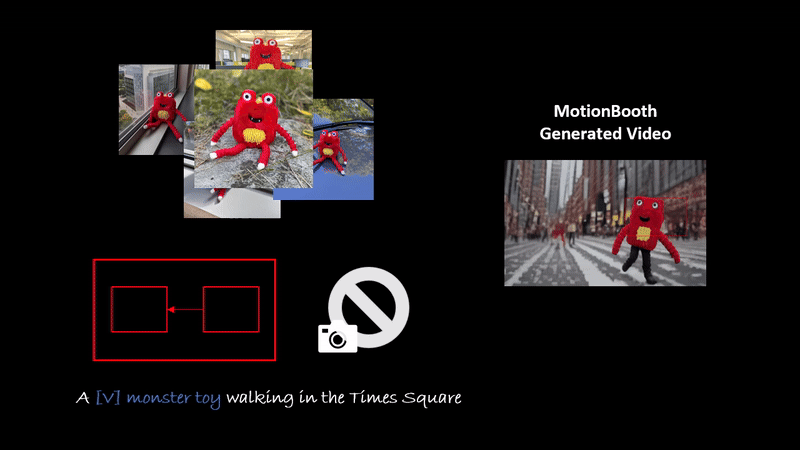
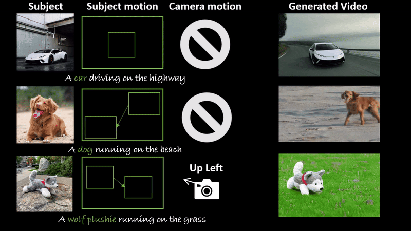

<br />
<p align="center">
  <h1 align="center">MotionBooth: Motion-Aware Customized <br> Text-to-Video Generation</h1>
  <p align="center">
    <br />
    <a href="https://jianzongwu.github.io/"><strong>Jianzong Wu</strong></a>
    ·
    <a href="https://lxtgh.github.io/"><strong>Xiangtai Li</strong></a>
    ·
    <a href="https://zengyh1900.github.io/"><strong>Yanhong Zeng</strong></a>
    ·
    <a href="https://zhangzjn.github.io/"><strong>Jiangning Zhang</strong></a>
    .
    <a href="https://qianyuzqy.github.io/"><strong>Qianyu Zhou</strong></a>
    .
    <a href="https://github.com/ly015"><strong>Yining Li</strong></a>
    ·
    <a href="https://scholar.google.com/citations?user=T4gqdPkAAAAJ"><strong>Yunhai Tong</strong></a>
    .
    <a href="https://chenkai.site/"><strong>Kai Chen</strong></a>
  </p>

  <p align="center">
    <a href='TODO'>
      
    </a>
    <a href='TODO'>
      
    </a>
    <a href='https://jianzongwu.github.io/projects/motionbooth'>
      
    </a>
  </p>
<br />

# Examples

**Customization and subject motion control**



**Hybrid control on customization, subject and camera motion**




# 📢 Updates

- Code is coming soon!

# ⭐ Abstract

In this work, we present MotionBooth, an innovative framework designed for animating customized subjects with precise control over both object and camera movements. By leveraging a few images of a specific object, we efficiently fine-tune a text-to-video model to capture the object's shape and attributes accurately. Our approach presents subject region loss and video preservation loss to enhance the subject's learning performance, along with a subject token cross-attention loss to integrate the customized subject with motion control signals. Additionally, we propose training-free techniques for managing subject and camera motions during inference. In particular, we utilize cross-attention map manipulation to govern subject motion and introduce a novel latent shift module for camera movement control as well. MotionBooth excels in preserving the appearance of subjects while simultaneously controlling the motions in generated videos. Extensive quantitative and qualitative evaluations demonstrate the superiority and effectiveness of our method. Models and codes will be made publicly available.


# Citation

```
article{wu2024motionbooth,
  title={MotionBooth: Motion-Aware Customized Text-to-Video Generation},
  author={Jianzong Wu and Xiangtai Li and Yanhong Zeng and Jiangning Zhang and Qianyu Zhou and Yining Li and Yunhai Tong and Kai Chen},
  journal={arXiv pre-print},
  year={2024},
}
```
